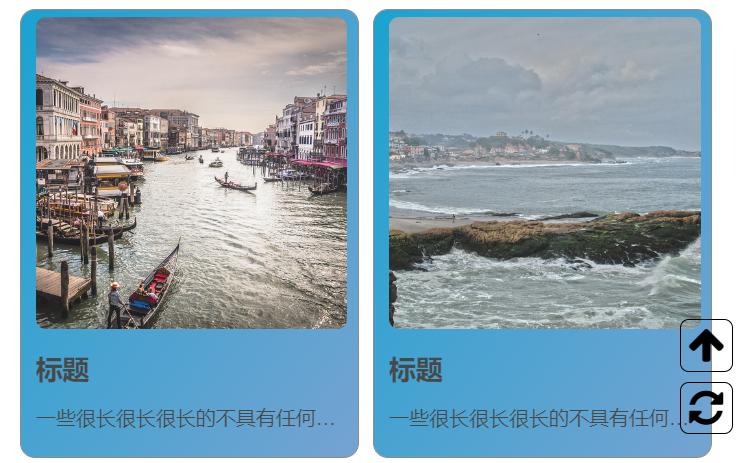
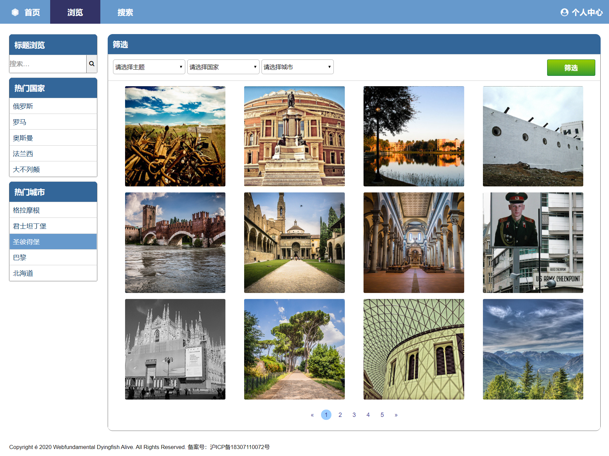

# 实验报告 #
姓名：赵书誉

学号：18307110072

Github地址：https://github.com/Dying-fish/19ss_Project1

Github Pages地址： https://dying-fish.github.io/19ss_Project1/
## 项目完成情况 ##
### 主页 ###

#### 导航栏 ####
导航栏与下拉菜单如图所示，首页旁边心血来潮地添加了logo，没有单独成列。首页高亮，颜色与鼠标悬浮时颜色不一致。
#### 头图 ####
略过
#### 图片展示 ####
布局和示例相似，此处使用的是自由版式的图片，解决方案在Bonus部分。图片描述设置成了文字超过一行就会省略。添加了一个“今日推荐”的标题，假装有这个功能。
#### 辅助图标 ####

使用positon：fixed固定在右侧，在浏览器窗口缩放时会显示在图片上方（感觉对观感影响不大）
#### 页脚 ####
页面右侧附上了我本人的微信二维码，底部备案号是我的学号。用户协议等均可点击但不会有反应，没有设置超链接。QQ图标等点击后会毫无意义地跳转至该软件的官网。
### 浏览页 ###

#### 导航栏 ####
浏览页显示高亮
#### 左侧边栏 ####
标题搜索栏输入后回车，是没有用的，要点击按钮才会弹出“已搜索出相应照片”。国家与城市是随意填的，点击后会弹出“已刷新出该国家/城市的照片”。鼠标悬浮时会高亮。
#### 筛选栏 ####
筛选栏分为主题，国家，城市三部分，主题有雨景，雪景，建筑与人文，国家与城市之间实现了二级联动。代码如下：
```javascript
/*定义各个国家的城市选项*/
var area = [
    ["重庆", "四川", "上海","哈尔滨"],
    ["东京", "大阪","北海道","名古屋"],
    ["洛杉矶", "纽约","夏威夷","旧金山"],
    ["圣彼得堡", "莫斯科","喀山","诺夫哥罗德"]
  ];
function changeSelect() {
    var selectCoutry = document.form1.country;
    var selectCity = document.form1.city;
    /*获取选择的国家对应的城市数组*/
    var countryArea = area[selectCoutry.selectedIndex - 1];
    selectCity.length = 1;
    for(var i=0; i < countryArea.length; i++){
      /*创建城市选项*/
      selectCity[i+1] = new Option(countryArea[i],countryArea[i]);
    }
}
```
#### 浏览结果 ####
如图所示，有页码（摆设）
### 搜索页 ###
#### 导航栏 ####
搜索页高亮
#### 搜索栏 ####
有标题查询与描述查询，回车键依旧没反应，需要点击查找按钮。标题查询输入时有动画效果，是学(jie)自(jian)菜鸟驿站的教程。
#### 搜索结果 ####
图片，标题，简(ge)介(ci)与上传日期，没有选择用js直接把浏览时间作为上传日期显示，有摆设的页码。
### 我的照片 ###
与搜索页的搜索结果区别不大，多了两个按钮，点击有反应。
### 我的收藏 ###
同上
### 上传页面 ###
#### 照片上传部分 ####
html中限制了上传文件的类型
```html
<input id="upload" type="file" accept="image/*" onchange="showFile()">
```
JavaScript代码（百度搜索得来）
```javascript
/*定义显示预览图的函数*/
function showFile() {
  var preview = document.querySelector('img');
  var file    = document.querySelector('input[type=file]').files[0];
  /*读取上传文件*/
  var reader  = new FileReader();
  /*将网页种空图片的src改成上传文件*/
  reader.onloadend = function () {
    preview.src = reader.result;
  }
  if (file) {
    reader.readAsDataURL(file);
  } else {
    preview.src = "";
  }
}
```
效果如下
#### 照片信息填写 ####
如图，没有设置必填选项，文本框部分设置为无法缩放，因此最多显示三行文字（可以下拉），点击提交按钮后可以跳转至**我的照片**。
### 照片详情页 ###
#### 页面 ####
如图，最上方是标题，左侧是垂直居中的图片，右侧是图片信息，信息中包含作者（点击按钮后弹出“已关注”），标签与热度（展示该图片已被收藏的数量），还有收藏按钮，点击弹出“已收藏”。
#### 图片描述 ####
字面意思，右下角有图片上传时间（
### 登录/注册界面 ###
#### 标志 ####
从font-awesome中选取的，觉得好看且不做商用就用了。
#### 欢迎语 ####
迫害群友，请勿在意
#### 输入界面 ####
如图，密码不显示明文，没有设置必填，点击按钮后跳转界面。
可以点击下方蓝色文字跳转至注册/登录界面。
## Bonus完成情况 ##
#### 自由版式图片 ####
使用了css3中自适应布局单位vw，用vw设置一个div块元素的长宽度，然后将要浏览的照片设置为背景，超出部分隐去。
类似下面这种
```
div{
	background-image: url(../../images/small/5856654945.jpg);
	/*图片居中*/
    background-position:center;
	/*图片缩放，填满整个区域*/
    background-size: cover;
    width:16.5vw;
    height:16.5vw;
}
```
#### 响应式布局 ####
由于写的时候以flex布局为主，因此浏览器可视区域变化时对布局结构的影响不大，只是个别地方会不协调，例如图片展示，因此在CSS中根据可视区域大小变化设置不同的图片大小，但图片详情页等地方还是会显得不协调（max-width<600px时）
修改方法：
```
/*根据可视区域大小变化设置不同的属性值*/
@media screen and (max-width: 1000px){}
@media screen and (max-width: 600px){}
```
## 意见与建议 ##
暂时没有意见，上课体验良好，可以的话希望上交的lab作业可以有反馈，得知自己平时的学习情况。